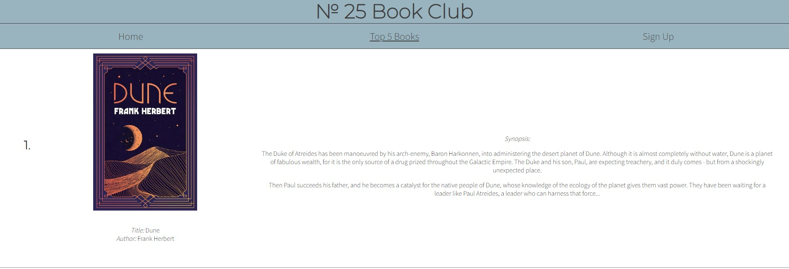

# № 25 Book Club

This book club website is a place for people between the ages of 20 to 30 looking for an active reading community. This club offers a wide range of genres for people to enjoy.

User can use this website to see what joining a book club will give them. On our top 5 books page they will see a selection of favourite books of the community and includes a synopsis for them to see if they would enjoy it as well.

## Features
- ### The Header and Navigation
    - Positioned at the top of the page is the title of the book club. Directly underneath is the navigation links to the other pages.
    - The navigation links are: Home, Top 5 Books, and Sign Up. Each of these links will take you to a unique page.
    - To highlight which page the user is currently on an underline will appear on the corresponding navigation bar link. Also, when the user hovers over another of the navigation links an underline will appear when it can be selected.
    - The navigation bar allows the user to quickly and easily transvers the website to find the information they are seeking. On all pages the navigation bar and title are in the same position to allow the user to intuitively use the website.

- ### The hero image
    - The hero image chosen is a very neutral bookcase and books which flows with the design of the website.
    - The quotes used are on a partially opaque background colour overlapping the hero image. The first quote is in the primary optical area of the image. This will allow the user to know what to look for concerning the second quote.
    - These quotes are about the importance and the pleasure reading can give you which is perfect to entice potential members.

- ### Why join us
    - This section details the benefits of reading and joining our community.
    - This section also includes two photos of people enjoying books within the age range the website caters for.
    - At the bottom is a video of an interesting ted talk further going into detail of the benefits of reading.

- ### The footer
    - The footer contains three links to Facebook, Instagram, and Twitter.
    - These are shown as the well-known logo of each social media site.

- ### The Top 5 Books</h3>
    - This area shows five books which have been voted the top 5 by the community. Each book is ranked from one to five and shows the top book first.
    - An image of the front cover of the book is used to draw the user’s eye and interest them in reading the synopsis. The title and author are written below in case the user is unable to make out the information from the image.
    - The synopsis is included to give the user a quick understanding of what the book is about and interest them in starting to read it themselves.

- ### The Sign Up form
    - The sign up form has a background of a dark bookshelf with a blurring effect.
    - The form itself has an exciting title of ‘Join the club!’ to excite the user to complete the form.
    - The form collects the users first and last name their email address. Then also asks them to select their favourite genres.
    - The sign up form allows the user to join the book club which is the overall goal of the website.

## Surface
- ### Colours
    - The background colour used is #99B4BF and the colour of the text is #3D3D3D these both contrast well with a contrast ration of 4.98 : 1.

- ### Fonts
    - The fonts used for the h1, h2, h3 is Montserrat with a backup of Open Sans. The font used for the rest of the text is Source Sans Pro with a backup of Lato.

- ### Images
    - The images were found on [pexels.com](https://www.pexels.com/) and the book covers were found on [Waterstones.com](https://www.waterstones.com/). The image source is in the [credits](#credits) section.

## Technologies used
- ### HTML5
    - As a structure language.

- ### CSS3
    - As a style language.

- ### Font Awesome
    - As an icon library for social links.

- ### Google fonts
    - As a font resource.

- ### GitHub
    - As a software hosting platform.

- ### Git
    - As a version control tracking system.

- ### Gitpod
    - As a development hosting platform.

## Testing
- ### Functionality and compatibility testing
    - I have used Chrome developer tools throughout the project for testing and solving style and responsiveness problems.
    - I have tested this site across multiple virtual devices. I have also checked the site on iPhone, iPad, and a Samsung phone.

- ### Issues found during site development
    - The checkbox options on the sign up page when the screen shrunk the text and check boxes was broken up at certain widths.

    

    - I used HTML to put the checkboxes in divs and then applied CSS style to those divs given them a width of 50%. Then used media queries for when appropriate to make them a width of 100%.
    - Images where not showing once the site was pushed to live.

    

    - I found I have not put the background url in commas. Once I had added these in the images then appeared.

- ### Performance testing

    - Lighthouse report for ‘Home’ page

    

    - Lighthouse report for ‘Top 5 Books’ page

    

    - Lighthouse report for ‘Sign Up’ page

    

- ### Code Validation
    - I used [W3C CSS Validator](https://jigsaw.w3.org/css-validator/) and [Validator w3](https://validator.w3.org/) to test CSS and HTML respectively.

    - Validator response of HTML for 'Home' page

    

    - Validator response of HTML for 'Top 5 Books' page

    

    - Validator response of HTML for 'Sign Up' page

    

    - Validator response of CSS

    

## Deployment
The site was deployed to GitHub pages. The steps to deploy the site are as follows:
- In the GitHub repository, go to the ‘Settings’ tab.
- They select the ‘Pages’ option in the ‘Code and automation’ section.
- From the source dropdown select ‘Branch: main’ and then select ‘Save’.
- The site is now published at https://harveyburton96.github.io/book-club/

## Credits
- To complete this project I used Code Institute student template: [gitpod-full-template](https://github.com/Code-Institute-Org/gitpod-full-template)

- Ideas and knowledge
    - [w3schools](https://www.w3schools.com/)
    - Code institute Diploma in Full Stack Software Development (Common Curriculum) course
    - [Marcin-kli/MP1s README.md](https://github.com/marcin-kli/MP1/blob/Milestone-Projects/README.md#new-user-goals)

- Code
    - Code was used from the love-running example from the code institute course.

- Content
    - Quotes
        - [Quote 1](https://www.oprahdaily.com/life/g30000006/best-quotes-about-reading/?slide=12)
        - [Quote 2](https://www.oprahdaily.com/life/g30000006/best-quotes-about-reading/?slide=24)

    - Why join us text
        - [General text 1](https://baos.pub/8-life-changing-benefits-of-reading-30-minutes-a-day-fa95ab1efdea)
        - [General text 2](https://www.lifehack.org/articles/lifestyle/10-benefits-reading-why-you-should-read-everyday.html)

    - Top 5 book page synopsis and book cover image was taken from waterstones
        - [Dune](https://www.waterstones.com/book/dune/frank-herbert/9781473233959)
        - [Sherlock Holmes](https://www.waterstones.com/book/the-complete-sherlock-holmes/arthur-conan-doyle/p-d-james/9780099529934)
        - [Frankenstein](https://www.waterstones.com/book/frankenstein/mary-shelley/9780141198965)
        - [Death on the Nile](https://www.waterstones.com/book/death-on-the-nile/agatha-christie/9780008328917)
        - [The song of Achilles](https://www.waterstones.com/book/the-song-of-achilles/madeline-miller/9781408891384)

    - Images source
        - [Oladimeji Ajegbile: man reading a book](https://www.pexels.com/photo/man-reading-a-book-3118214/)
        - [cottonbro: photo of woman carrying stack of books](https://www.pexels.com/photo/photo-of-woman-carrying-stack-of-books-6344096/)
        - [Janko Ferlic: light inside library](https://www.pexels.com/photo/light-inside-library-590493/)
        - [Taryn Elliott: books on white wooden shelf](https://www.pexels.com/photo/books-on-white-wooden-shelf-9565965/)

## Screenshots
Project screenshots

